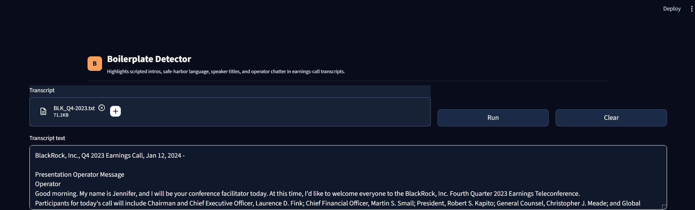
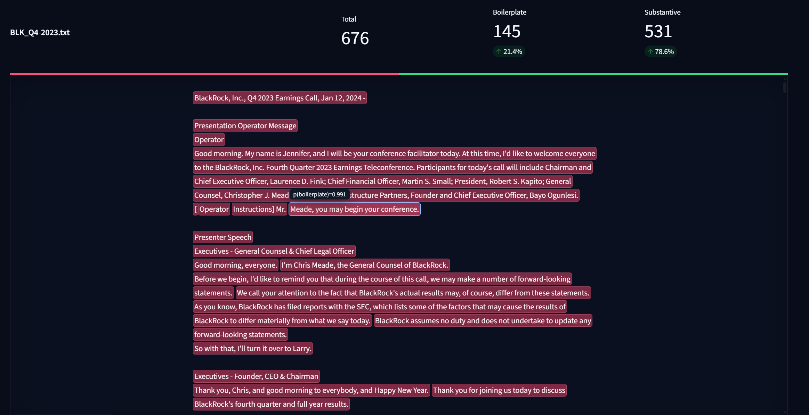

# Boilerplate vs. Substantive Sentence Classifier

Hao Wang

## 1. Introduction

This project builds an end-to-end classifier for earnings-call transcript sentences. The goal is to separate low-information boilerplate from substantive business content. Boilerplate includes operator instructions, greetings, safe-harbor language, replay/webcast disclosures, generic thanks, speaker introductions, and other scripted or procedural text. Substantive sentences include material business discussion: financial results, guidance, demand/pricing commentary, strategy, capital allocation, operations, risk, product/customer discussion, and substantive Q&A.

The final system has four parts: sentence extraction from raw transcripts, multi-LLM gold-label creation with human audit, a benchmark of seven classifier families under a recall constraint, and a Streamlit GUI that highlights boilerplate inline in a transcript. The best single model is a **weighted-probability ensemble** of five member classifiers (SetFit, FinBERT, Tree-Enriched, Linear Embeddings, and FastText), which achieves 98.0% accuracy and 95.05% macro-F1 on the held-out test set.

## 2. Corpus Construction

The raw corpus consists of 131 earnings-call transcript text files in `data/raw_transcripts`. The extraction stage normalizes line endings, removes repeated blank-line runs, optionally deduplicates repeated transcript lines, splits transcripts into segments by structural markers (`Question`, `Answer`, `Operator`, `Analysts - ...`, `Executives - ...`), and then applies NLTK sentence tokenization within each segment. Sentences shorter than 40 characters are removed to avoid fragments, one-word answers, and metadata-like lines that provide little training signal.

The extraction stage generated **56,028** candidate sentences. From this pool, 2,500 gold-label candidates were sampled using the project random seed (`42`), stored in `data/interim/gold_candidates.parquet`, and used as the basis for all subsequent labeling and classifier training.

After final labeling, the labeled set is split into **60% train, 20% validation, and 20% test** with stratification by label. The test set is frozen and used only for final evaluation.

**Final gold-label statistics:**

| Quantity | Value |
|---|---:|
| Raw transcripts | 131 |
| Extracted sentence pool | 56,028 |
| Gold-label sample | 2,500 |
| Final labeled rows | 2,500 |
| Train rows | 1,500 |
| Validation rows | 500 |
| Test rows | 500 |
| Boilerplate labels | 284 (11.4%) |
| Substantive labels | 2,216 (88.6%) |
| Imbalance ratio | ~1 : 7.8 |

The dataset is heavily class-imbalanced (1 boilerplate for every ~7.8 substantive sentences), which motivates the recall-constrained threshold selection described in Section 6.

## 3. Gold-Standard Methodology

### Label Definitions

The labeling task is binary:

| Label | Integer | Meaning |
|---|---:|---|
| `boilerplate` | 1 | Scripted, procedural, generic, or low-information text |
| `substantive` | 0 | Material company-specific business content |

The positive probability used by all models is `p(boilerplate)`. Thresholding predicts `boilerplate` when `p(boilerplate) >= threshold` and `substantive` otherwise.

### Rubric and Prompt Design

The judge prompt is built from a single rubric in `src/rubric.py`. The rubric defines both classes, provides anchor examples, and includes explicit edge-case rules:

- Analyst or speaker introductions are boilerplate.
- Generic thanks and turn-taking language are boilerplate.
- One-word answers such as "Yes" or "No" are boilerplate unless surrounded by explicit material content.
- Mixed sentences are substantive if they contain clear material business information.
- Business-related questions in Q&A are substantive even if they include conversational filler.
- High-level summaries of company performance are substantive if they describe company progress or performance.
- Transition sentences such as "next I will ask..." are boilerplate.
- Navigation statements such as "the data is on slide 26" are boilerplate.
- Abstract commentary about the general environment is boilerplate unless tied to the company's own actions or results.

For speed, the labeling code sends batches of sentences to each judge. The prompt requests valid JSON:

```json
{
  "results": [
    {"sentence_id": 123, "label": "boilerplate", "reason": "short explanation"}
  ]
}
```

The parser validates that every input `sentence_id` appears exactly once, that no unexpected IDs are returned, and that every label is either `boilerplate` or `substantive`. Malformed batch responses are retried with the validation error included; persistent failures fall back to single-sentence retries. Only sentences that fail both batch and single-sentence retries are marked `error`.

### Judge Models

Three LLM judges were used:

| Judge name | Provider | Model | Role |
|---|---|---|---|
| `gpt5.4_mini` | OpenAI | `gpt-5.4-mini` | Fast high-quality hosted judge |
| `sonnet4_6` | Anthropic | `claude-sonnet-4-6` | Strong hosted judge with independent provider |
| `qwen3_4b` | Ollama local | `qwen3:4b` | Local open-weight reference judge |

The original plan included `qwen3.6:27b`, but the model was too heavy to run reliably on the available local hardware. Switching to `qwen3:4b` made the local baseline practical; it is treated as a weaker supporting signal rather than an equal tie-breaker.

**Approximate judge runtimes:**

| Judge | Runtime |
|---|---:|
| OpenAI `gpt-5.4-mini` | ~10 min |
| Anthropic `claude-sonnet-4-6` | ~29 min |
| Local `qwen3:4b` | ~9 hours |

### Human Audit Policy

`gpt-5.4-mini` and `claude-sonnet-4-6` are treated as the two primary judges. When they agree, their shared label is accepted without further review. When they disagree, the sentence is manually reviewed, with the `qwen3:4b` label and reasoning used as auxiliary evidence.

**Agreement and audit statistics:**

| Quantity | Value |
|---|---:|
| Gold-label sample | 2,500 |
| GPT / Sonnet disagreement rows | 236 (9.4%) |
| GPT / Sonnet agreement rows accepted directly | 2,264 (90.6%) |
| Audit file rows reviewed | 256 |

Reviewed override labels are merged back into `data/interim/audit_sample.csv` before `finalize_gold` runs. The full audit file is `data/interim/audit_sample_openai_anthropic_disagreements.csv`.

## 4. Feature Engineering

The `features` stage constructs three reusable feature groups, and the rule-based family adds a fourth interpretable signal layer at model time.

**Regex indicator features (20 binary flags):**

| Feature group | Examples |
|---|---|
| Procedural boilerplate | `operator`, `thank you`, `good morning`, `next question`, `webcast`, `replay` |
| Legal / reporting boilerplate | `forward-looking statement`, `non-GAAP`, `SEC`, `10-K`, `10-Q`, `8-K` |
| Business content signals | dollar amounts, percentages, quarter/year-over-year language, guidance, margins, EPS, revenue, strategy, capex, demand |

**Surface features (6 numeric):** character length, token length, digit count, uppercase ratio, punctuation count, question-mark indicator.

**Sentence embeddings:** Frozen embeddings from `mxbai-embed-large` via local Ollama:

```yaml
embedding_provider: ollama
sentence_embedding_model: mxbai-embed-large
normalize_embeddings: true
```

The embedding cache is saved as `data/cache/embeddings_all.npy`. `mxbai-embed-large` was selected per the assignment recommendation; it provides stronger semantic representations than a small MiniLM baseline while remaining fully local.

**Rules + regex scoring:** The `rules_regex` family combines keyword lists and regex pattern groups for both classes. Boilerplate rules cover operator instructions, greetings, safe-harbor disclosures, webcast/replay language, and speaker/title lines. Substantive rules cover financial results, guidance, margins, EPS, demand, strategy, products, customers, capital allocation, and Q&A content. The model converts the relative boilerplate/substantive rule scores into `p(boilerplate)`.

**Feature artifacts:**

| Artifact | Description |
|---|---|
| `data/interim/features_regex.parquet` | Gold rows plus all regex and surface features |
| `data/cache/embeddings_all.npy` | Frozen sentence embeddings for the labeled sample |

## 5. Classifier Zoo

Seven classifier families are benchmarked:

| Family | Implementation | Why included |
|---|---|---|
| Rules + regex | Weighted keyword and regex scores for boilerplate vs. substantive signals | Very fast, interpretable, catches stereotyped boilerplate |
| Linear embeddings | Logistic regression on frozen embeddings | Strong semantic baseline |
| Tree enriched | HistGradientBoosting on embeddings + regex/surface features | Captures nonlinear interactions between semantic and hand-crafted features |
| fastText | Meta fastText supervised classifier | Compact n-gram text model, fast inference |
| FinBERT | Fine-tuned `ProsusAI/finbert` sequence classifier | Finance-domain transformer baseline |
| SetFit | Contrastive fine-tuning with `all-MiniLM-L6-v2` | Strong performance with limited labeled data |
| Ensemble | Weighted probability average over top members | Stabilizes predictions by combining complementary models |

fastText uses the standard supervised format:
```
__label__boilerplate sentence text...
__label__substantive sentence text...
```

**Final refit training times:**

| Family | Training time |
|---|---:|
| FinBERT | ~36 min (2,180 s) |
| SetFit | ~27 min (1,650 s) |
| Tree enriched | ~7 s |
| fastText | ~6 s |
| Linear embeddings | <1 s |
| Rules + regex | instant |

## 6. Hyperparameter Search and Threshold Selection

### Recall-Constrained Objective

Model selection is not based on raw accuracy. For each configuration, the code trains the model, computes validation probabilities, and searches thresholds under the constraint:

```
substantive recall >= 0.96
```

Among feasible thresholds, the selected threshold maximizes macro-F1. This ensures that the grid search selects parameters at the same operating point used in the final classifier.

### Grid Search

The grid search is intentionally small to remain practical:

| Family | Parameters searched | Combinations |
|---|---|---:|
| Rules + regex | none | 1 |
| Linear embeddings | `C in {0.1, 1.0, 10.0}` | 3 |
| Tree enriched | HistGBM max_depth, learning_rate, max_iter | 8 |
| fastText | learning_rate, epochs, word n-grams | 12 |

FinBERT and SetFit are kept fixed because each trial requires expensive fine-tuning.

**Best grid-search parameters and validation scores:**

| Family | Best parameters | Val threshold | Val sub. recall | Val macro-F1 |
|---|---|---:|---:|---:|
| Rules + regex | (none) | 0.21 | 0.993 | 0.809 |
| Linear embeddings | C = 10.0 | 0.61 | 0.971 | 0.911 |
| Tree enriched | HistGBM depth=3, lr=0.1, max\_iter=300 | 0.04 | 0.982 | 0.932 |
| fastText | lr=0.25, epoch=50, wordNgrams=2 | 0.38 | 0.987 | 0.894 |

### Out-of-Fold Threshold Tuning

After grid search, thresholds are re-tuned using 5-fold cross-validation on the combined train+validation pool. For each fold the model is retrained, probabilities are predicted on the held-out fold, and predictions from all folds are pooled before the final threshold search. This pooled-OOF approach is more robust than a single validation split.

For transformer families (FinBERT, SetFit), retraining once per fold is expensive. For the ensemble, saved OOF probabilities from member models are reused and weighted without retraining.

**OOF threshold-tuning results:**

| Family | OOF threshold | OOF macro-F1 | OOF sub. recall |
|---|---:|---:|---:|
| Rules + regex | 0.22 | 0.799 | 0.987 |
| Linear embeddings | 0.67 | 0.909 | 0.980 |
| Tree enriched | 0.16 | 0.913 | 0.989 |
| fastText | 0.20 | 0.895 | 0.981 |
| FinBERT | 0.73 | 0.927 | 0.990 |
| SetFit | 0.60 | 0.936 | 0.994 |
| Ensemble (5 members) | 0.33 | 0.936 | 0.986 |

**Grid-search outputs:**

| Artifact | Description |
|---|---|
| `outputs/grid_search/grid_search_results.parquet` | All searched combinations and threshold-constrained scores |
| `outputs/grid_search/best_hyperparams.json` | Best parameters per searched family |
| `outputs/thresholds/best_thresholds.json` | Final OOF-tuned thresholds for all families |
| `outputs/thresholds/oof_probabilities.parquet` | Pooled OOF probabilities used for threshold selection |

## 7. Final Test Results

After threshold tuning, `train_all` refits all families on the combined train+validation pool. `evaluate` applies the OOF-tuned thresholds to the frozen 500-sentence test set and exports a leaderboard, per-family confusion matrices, and error-analysis files.

### Leaderboard

| Rank | Family | Threshold | Accuracy | Macro-F1 | BP Precision | BP Recall | BP F1 | Sub. F1 | Sub. Recall |
|---:|---|---:|---:|---:|---:|---:|---:|---:|---:|
| 1 | **Ensemble** | 0.35 | **0.980** | **0.950** | 0.912 | 0.912 | 0.912 | 0.989 | 0.989 |
| 2 | SetFit | 0.60 | 0.978 | 0.944 | 0.926 | 0.877 | 0.901 | 0.988 | 0.991 |
| 3 | FinBERT | 0.73 | 0.978 | 0.942 | 0.960 | 0.842 | 0.897 | 0.988 | 0.995 |
| 4 | Linear embeddings | 0.67 | 0.966 | 0.919 | 0.823 | 0.895 | 0.857 | 0.981 | 0.975 |
| 5 | Tree enriched | 0.16 | 0.966 | 0.915 | 0.857 | 0.842 | 0.850 | 0.981 | 0.982 |
| 6 | fastText | 0.20 | 0.958 | 0.897 | 0.810 | 0.825 | 0.817 | 0.976 | 0.975 |
| 7 | Rules + regex | 0.22 | 0.912 | 0.746 | 0.667 | 0.456 | 0.542 | 0.951 | 0.971 |

All models meet the >=0.96 substantive-recall floor on the held-out test set.

### Best Model: Ensemble

The ensemble is selected as the best model. It uses **weighted probability averaging** over five member models:

| Member | OOF macro-F1 (weight) |
|---|---:|
| SetFit | 0.9358 |
| FinBERT | 0.9273 |
| Tree enriched | 0.9133 |
| Linear embeddings | 0.9088 |
| fastText | 0.8949 |

Each member's weight equals its pooled OOF macro-F1. The ensemble prediction is the weighted average of member `p(boilerplate)` outputs. The threshold (0.35) is tuned separately on the pooled OOF ensemble probabilities. Including transformer families in the ensemble is controlled by `models.ensemble.include_transformers: true` in `config.yaml`; here, all five families are included.

The ensemble improves over the best single model (SetFit, macro-F1 = 0.944) by stabilizing predictions: when one member is uncertain, the other members compensate. The boilerplate F1 gain from SetFit to ensemble (0.901 to 0.912) reflects reduced false-positive and false-negative variance without sacrificing substantive recall.

Packaged inference metadata is saved to `artifacts/best_model/metadata.json`.

### Confusion Matrices

To save space, the confusion matrices are reported as counts rather than embedded figures. `BP` means boilerplate and `Sub` means substantive.

| Family | Actual BP -> Pred BP | Actual BP -> Pred Sub | Actual Sub -> Pred BP | Actual Sub -> Pred Sub |
|---|---:|---:|---:|---:|
| Ensemble | 52 | 5 | 5 | 438 |
| SetFit | 50 | 7 | 4 | 439 |
| FinBERT | 48 | 9 | 2 | 441 |
| Linear embeddings | 51 | 6 | 11 | 432 |
| Tree enriched | 48 | 9 | 8 | 435 |
| fastText | 47 | 10 | 11 | 432 |
| Rules + regex | 26 | 31 | 13 | 430 |

### Error Analysis

**Test-set error counts (500 sentences):**

| Family | Errors | Error rate |
|---|---:|---:|
| Ensemble | 10 | 2.0% |
| SetFit | 11 | 2.2% |
| FinBERT | 11 | 2.2% |
| Linear embeddings | 17 | 3.4% |
| Tree enriched | 17 | 3.4% |
| fastText | 21 | 4.2% |
| Rules + regex | 44 | 8.8% |

**Representative error sentences:**

| Family | Example error |
|---|---|
| Rules + regex | "Well, thank you, Bascome, for raising that question." |
| Linear embeddings | "Analysts - Research Analyst Some regional banks have pointed to..." |
| Tree enriched | "He has served as CIO for the last 24 years leading FedEx in modernizing our IT infrastructure." |
| fastText | "Now turning to our consolidated statement of earnings for the third quarter of 2024." |
| FinBERT | "Analysts - Research Analyst Some regional banks have pointed to..." |
| SetFit | "Now turning to our consolidated statement of earnings for the third quarter of 2024." |
| Ensemble | "But just for the sake of helping you tidy up models, I wanted to make that point." |

The dominant failure mode across all models is **mixed or ambiguous sentences**: text that combines procedural phrasing with substantive content, or that is stylistically generic while being situationally material.

Per-family error CSV files are saved to `outputs/error_analysis/error_analysis_<family>.csv`.

## 8. GUI

The GUI is implemented in Streamlit and launched with:

```powershell
streamlit run src/gui_app.py
```

**Features:**

- **Input**: Upload a `.txt` transcript file or paste transcript text directly into the text area.
- **Run**: Click the **Run** button to trigger inference. The app tokenizes the transcript, extracts the same regex/surface/embedding features used in training, loads the packaged best-model metadata from `artifacts/best_model/metadata.json`, and runs the ensemble.
- **Highlighted viewer**: The full transcript is displayed inline in a dark-background reading panel. Boilerplate sentences are highlighted in **red** (`rgba(170, 53, 83, 0.72)`); substantive sentences appear in plain text.
- **Hover tooltip**: Hovering over any sentence (boilerplate or substantive) shows a floating tooltip with the predicted `p(boilerplate)` value, making it easy to inspect borderline cases.
- **Summary metrics**: Above the viewer, the app displays total sentence count, boilerplate count and share, and substantive count.
- **Download**: A **Download predictions CSV** button exports the full sentence-level prediction table (sentence text, predicted label, `p(boilerplate)`, character offsets) for downstream analysis.

The GUI loads the ensemble automatically from the packaged metadata; no model family needs to be specified by the user.

**GUI display:**





## 9. Limitations and Next Steps

**Class imbalance.** The 11.4% boilerplate rate means that threshold selection is sensitive: a small shift in threshold can substantially change boilerplate recall. The OOF threshold-tuning procedure mitigates this, but individual fold thresholds can vary widely (e.g., tree enriched fold thresholds ranged from 0.01 to 0.39 across five folds).

**Labeling cost and scale.** The gold sample is 2,500 sentences from a 56,028-sentence pool. A larger audited sample would likely improve performance, especially for edge cases: short substantive Q&A questions, abstract but company-specific commentary, and mixed-content sentences.

**Judge weighting.** The audit strategy gives more weight to the two stronger hosted judges. The local Qwen judge provides an independent signal but is treated as secondary. Calibration of judge agreement could be more formally modeled.

**Ensemble inference speed.** The ensemble has no direct inference-speed measurement because it aggregates five member models, including two transformers. In practice, FinBERT runs at ~12 sentences/sec, making it the bottleneck. For latency-sensitive applications, a SetFit-only or tree-only configuration would be preferred.

**Future improvements:**
- Calibrate model probabilities after threshold tuning (Platt scaling or isotonic regression).
- Add confidence intervals or bootstrap variance for test metrics.
- Use active learning to send near-threshold sentences back to human audit.
- Expand grid search for FinBERT/SetFit if compute budget allows.

## 10. Reproducibility Commands

The project is controlled through `main.py` stages. A full run from an existing finalized gold set is:

```powershell
python main.py --stage from_gold
```

For targeted reruns:

```powershell
python main.py --stage grid_search
python main.py --stage tune_thresholds
python main.py --stage tune_thresholds --family finbert
python main.py --stage tune_thresholds --family ensemble
python main.py --stage train_all
python main.py --stage evaluate
python main.py --stage package_best
streamlit run src/gui_app.py
```

If trained models and thresholds already exist, the final evaluation and packaging can be reproduced with:

```powershell
python main.py --stage from_models
```

## 11. References and Disclosure

**Models and APIs:**

- OpenAI `gpt-5.4-mini` for LLM judging.
- Anthropic `claude-sonnet-4-6` for LLM judging.
- Ollama `qwen3:4b` for local LLM judging.
- Ollama `mxbai-embed-large` for frozen sentence embeddings.
- `ProsusAI/finbert` for the FinBERT classifier.
- `sentence-transformers/all-MiniLM-L6-v2` for SetFit.

**Libraries:**

- `pandas`, `numpy`, `pyarrow`: data processing and Parquet caching.
- `nltk`: sentence tokenization.
- `scikit-learn`: splits, metrics, logistic regression, tree models, threshold evaluation.
- `fasttext-wheel`: Meta fastText supervised classification.
- `transformers`, `datasets`: FinBERT fine-tuning.
- `setfit`: contrastive small-data classification.
- `matplotlib`: diagnostic figure generation.
- `streamlit`: GUI.
- `openai`, `anthropic`, `requests`: judge and Ollama API calls.
